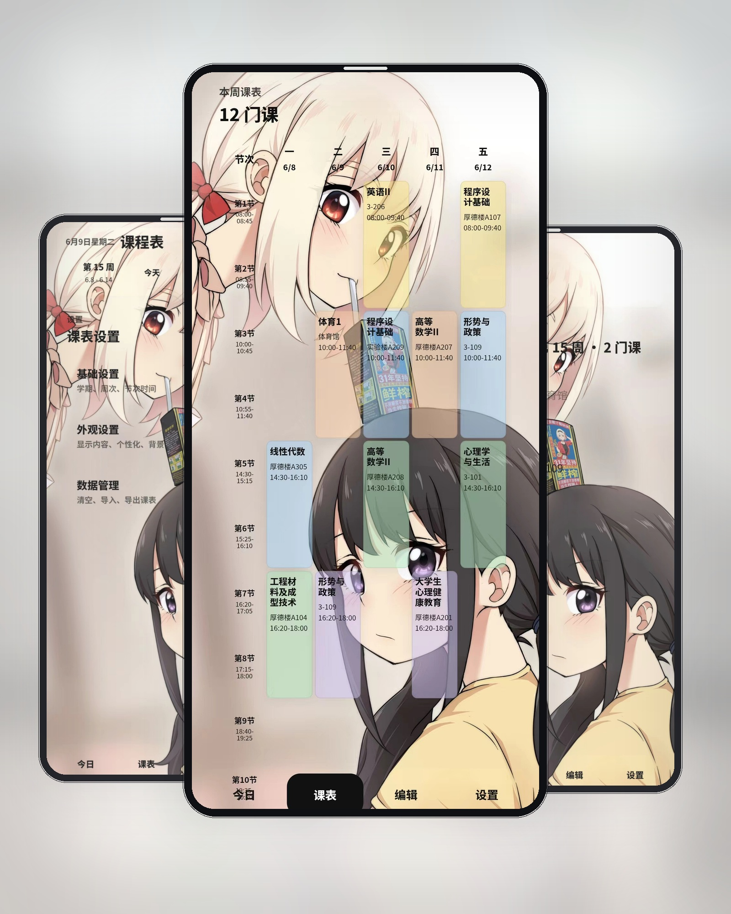

# 课程表

一款给自己和舍友用的轻量课程表应用。第一次打开会默认读取我的课表；如果你要给自己用，直接一键清空，再导入自己的 JSON 就行。

[](https://github.com/tanxue0118/kebiao/releases/latest)
[](./LICENSE)

## 预览

<p align="center">
  
</p>

<p align="center">
  
</p>

## 特点

- 开箱就能看：首次打开默认拉取仓库里的默认课表源，不用先做任何配置。
- 改课很顺手：点课程直接编辑，点空白处就能新增，导入、导出、一键清空都在同一套流程里。
- 看法更贴近日常：今日概览、周课表和桌面小组件一起做，平时最常看的信息都在。
- 课表更灵活：支持自定义节次时间、单门课程自定义时间、单双周、周次范围等常见排课方式。
- 样式能按习惯调：背景、显示字段、圆角、间距、格子高度、透明度等个性化配置都保留了。
- 小组件也会同步：Web 端保存后会刷新 Android 桌面小组件，尽量保持应用里看到的内容一致。

## 默认行为

- 首次打开会读取默认课表源。
- 默认课表就是我和舍友共用的那份。
- 如果你不是这份课表的使用者，直接一键清空就行。
- 清空后会停止远程读取，后续不会再自动把课程同步回来。
- 重新导入 JSON 或手动新增课程后，会恢复自动读取能力。

## 快速上手

1. 先正常打开应用。
2. 如果要自己使用，先点一键清空。
3. 导入自己的课表 JSON。
4. 需要改课时，直接点课表里的课程或空白格。

## 为什么 APK 这么轻

因为它没有把一整套重型跨端运行时塞进安装包里。

- 页面本体就是 `HTML + CSS + JavaScript`
- Android 侧只负责 WebView 壳和原生小组件
- 不依赖 React Native、Flutter、Electron 这类大运行时
- 不带数据库和一堆第三方 UI 包
- 课表数据直接用 JSON，本地保存也只是 `localStorage` 和 `SharedPreferences`

所以安装包主要是静态页面、少量 Java 类和 Android 资源，体积小，启动也快。

## 课表格式

详细字段规则和 AI 编写模板见 [编写规则.md](./编写规则.md)。

下面是一个简化示例，方便快速理解结构：

```json
{
  "courses": [
    {
      "id": "linear-algebra",
      "name": "线性代数",
      "teacher": "路老师",
      "position": "厚德楼A305",
      "day": 1,
      "startSection": 5,
      "endSection": 6,
      "weeks": [1, 2, 3, 4, 5, 6, 7, 8, 9, 10, 11, 12, 13, 14, 15, 16]
    }
  ]
}
```

如果是考试、临时安排或需要自定义时间的课程，直接看 [编写规则.md](./编写规则.md) 里的完整写法。

## 下载

- 仓库：[tanxue0118/kebiao](https://github.com/tanxue0118/kebiao)
- Release：[latest](https://github.com/tanxue0118/kebiao/releases/latest)

## 开源协议

本项目采用 [MIT License](./LICENSE)。

## Star 趋势

<a href="https://www.star-history.com/?repos=tanxue0118%2Fkebiao&type=date&legend=top-left">
 <picture>
   <source media="(prefers-color-scheme: dark)" srcset="https://api.star-history.com/chart?repos=tanxue0118/kebiao&type=date&theme=dark&legend=top-left" />
   <source media="(prefers-color-scheme: light)" srcset="https://api.star-history.com/chart?repos=tanxue0118/kebiao&type=date&legend=top-left" />
   
 </picture>
</a>
